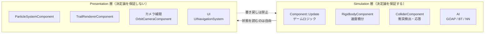
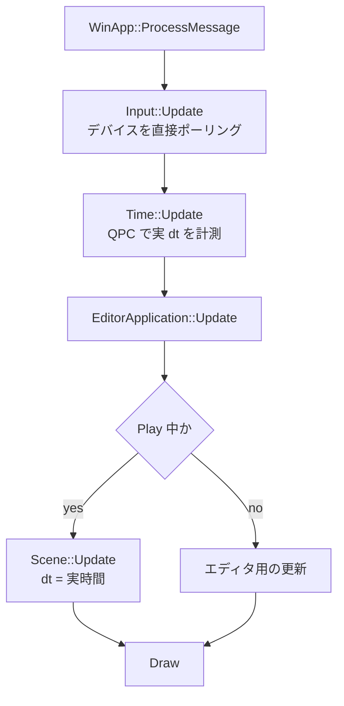
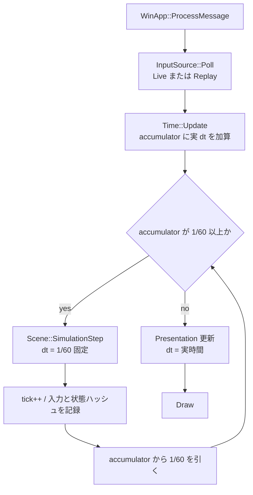

# 決定論とリプレイ — 設計

KujataEngine の差別化点として「決定論シミュレーション + リプレイ」を据えるための設計文書。
実装前に **何を決定論にし、何をしないか** を確定させるために書く。

- 対象: KujataEngine 本体（`KujataEngine/`）。ゲーム側（`DirectXGame/`）は規約に従う側。
- 状態: **設計のみ。実装は未着手。**
- 関連: [CLAUDE.md](CLAUDE.md) の「現在の方針」②
- **ティック・アクション層・コマンドの列・リプレイファイルの詳細は [tick-replay.md](tick-replay.md)。** Step 1・4・5 はそちらの設計で実装する。

---

## 1. なぜ決定論か

作者の専攻はゲームAI。エージェント（GOAP / ビヘイビアツリー / ニューラルネット）を作る上で、
汎用エンジンに無くて困るものが3つある。

| 欲しいもの | 決定論が無いと | 決定論があると |
|---|---|---|
| **再現デバッグ** | 「たまに変な動きをする」が二度と再現しない | 入力列を保存すれば必ず同じ挙動が出る |
| **公平な評価** | フレームレートが違うだけでスコアが変わり、AI の良し悪しを比較できない | 同じ条件で N 体を比較できる |
| **高速学習** | 描画に律速されて実時間でしか回せない | 描画を切って最大速度でエピソードを回せる |

つまり決定論は「リプレイ機能が欲しい」のではなく、**AI を研究するための実験装置としてエンジンを成立させる前提条件**である。
リプレイはその副産物として手に入る、目に見える成果物という位置づけ。

---

## 2. 決定論の契約

このエンジンが保証する内容を一文で定義する。

> **同じ初期シーン + 同じ seed + 同じ入力列 → 同じ状態列（状態ハッシュがビット単位で一致）**

保証のレベルを3段階に分け、**Tier 1 を当面の目標**とする。

| Tier | 内容 | 難易度 | 方針 |
|---|---|---|---|
| **Tier 1** | 同一ビルド・同一マシンでビット一致 | 低 | **これを取る。** 再現デバッグと学習ループはこれで足りる |
| Tier 2 | 同一ビルドなら別マシンでもビット一致 | 中 | 学習を複数 PC へ分散したくなったら取りに行く。`/fp:precise`（MSVC 既定）と `/arch` 固定で概ね届く |
| Tier 3 | 別コンパイラ・別プラットフォームで一致 | 高 | **追わない。** 固定小数点演算への全面移行が必要で、費用対効果が合わない |

---

## 3. 層の分離 — 最初に決めるべきこと

**「エンジン全体を決定論にする」は失敗する。** パーティクルや UI アニメまで決定論にしようとすると、
変更量が膨らんだ割に AI 研究には一切効かない。層を分けて、決定論の責務を狭く閉じ込める。



| | Simulation 層 | Presentation 層 |
|---|---|---|
| 時間 | **固定 dt（1/60 秒）** | 実時間 dt（可変のまま） |
| 乱数 | シム専用の決定論 RNG | 従来の `Random::` でよい |
| 実行回数 | 1フレームに 0〜N 回（アキュムレータ次第） | 1フレームに必ず 1 回 |
| ハッシュ対象 | **する** | しない |

**唯一の規約: Presentation 層は Simulation 層の状態を書き換えてはならない。** これさえ守れば、
演出がどれだけ実時間に依存していてもリプレイは成立する。

---

## 4. 現状の棚卸し

実コードを確認した結果。

### 有利な材料

- **更新ループが完全に単一スレッド**。`std::thread` / `std::async` / 並列 for の使用がゼロ。
  マルチスレッド由来の非決定性（実行順の揺れ）が最初から存在しない。
- **`Time::GetDeltaTime()` の使用箇所がエンジン全体で 7 ファイルだけ。** 固定タイムステップ化の影響面が小さい。
  - `scene/Scene.cpp` / `components/AnimatorComponent.cpp` / `components/OrbitCameraComponent.cpp`
    / `components/ParticleSystemComponent.cpp` / `components/TrailRendererComponent.cpp` / `2d/UINavigationSystem.cpp`
  - このうち **シム層に属するのは `Scene.cpp` のみ**。残りは全部 Presentation 層。
- **1 ステップの順序が既に確定している**（`Scene::Update`）。
  `Component::Update` → 速度積分 → ワールド行列更新 → 衝突検出/応答。そのままシムステップの定義に使える。
- `OnPlayStart` で非シリアライズ状態を初期化する規約が既にある = 状態リセットの下地ができている。

### 決定論が破れている箇所

| # | 箇所 | 問題 | 対応 Step |
|---|---|---|---|
| 1 | [`base/Time.cpp`](../KujataEngine/base/Time.cpp) `Update()` | QPC の実時間 dt をそのまま使う（`clamp(0, 1/30)` のみ）。フレームレートが状態に混入する | Step 1 |
| 2 | [`math/Random.h`](../KujataEngine/math/Random.h) `Initialize()` | `random_device` で seed を取るため毎回変わる。さらに **`std::uniform_real_distribution` は標準が実装を規定していない**ので、そのままでは移植性のある決定論に使えない | Step 2 |
| 3 | [`scene/GameObject.cpp`](../KujataEngine/scene/GameObject.cpp) `GenerateInstanceId()` | `steady_clock` + `random_device` から生成。実行ごとに ID が変わる | Step 3 |
| 4 | [`scene/SceneCollisionSystem.cpp`](../KujataEngine/scene/SceneCollisionSystem.cpp) `SceneCollisionSystem::Update()` | `pairStates_` が `unordered_map<std::string, …>` で、**Exit 通知をハッシュ順で回している**。#3 と組み合わさると `OnCollisionExit` / `OnTriggerExit` の呼び出し順が実行ごとに変わりうる。**現時点で最も影響が大きい** | Step 3 |
| 5 | [`scene/SceneCollisionSystem.cpp`](../KujataEngine/scene/SceneCollisionSystem.cpp) broadphase | `std::sort` が `aabb.min.x` のみを比較する非安定ソート。X が同値のコライダー同士で応答順が壊れやすい | Step 3 |
| 6 | [`input/Input.cpp`](../KujataEngine/input/Input.cpp) | 毎フレーム DirectInput / XInput を直接ポーリングしており、記録・再生レイヤを差し込む余地がない | Step 4 |

> #4 と #5 は決定論と関係なく **現時点でも潜在バグ**。衝突の Exit が来る順に依存したゲームコードを書くと、
> 再現しない不具合として現れる。

### 浮動小数点について

MSVC は `/fp:precise` が既定で、式の並べ替えや FMA への自動縮約を行わない。
`.vcxproj` に `/fp:fast` は入っていないため、**Tier 1 の範囲では現状のままで問題ない。**
Tier 2 を取りに行く段になったら `EnableEnhancedInstructionSet`（`/arch`）を exe と GameModule で明示的に揃える必要がある。

---

## 5. 目標とするフレームループ

### 現在



実 dt が直接ゲームロジックへ流れ込むため、**フレームレートが変われば結果が変わる。**

### 目標



**差し替え箇所は 1 行しかない。** シム呼び出しの唯一の入口は
[`Editor/EditorApplication.cpp`](../KujataEngine/Editor/EditorApplication.cpp) の `Update()` 内にある
`currentScene_->Update()` で、ここを `while (accumulator >= fixedDt) { … }` に置き換えれば済む。

---

## 6. ロードマップ

各 Step に **完了条件（何をもって出来たとするか）** を必ず置く。
このプロジェクトはユニットテストを運用しないため、完了条件は「実機で観測できる形」で書く。

### Step 0: 層の線引きを確定させる ← 本ドキュメント

完了条件: §3 の表の通りに各 Component を分類し、合意する。

---

### Step 1: 固定タイムステップ

- `Time` に `fixedDeltaTime_`（既定 1/60）とアキュムレータを追加。
- Play 中の `Time::GetDeltaTime()` は固定値を返す。Edit 中と Presentation 層は従来通り実時間。
- `Scene::Update()` を `Scene::SimulationStep()` へ改名し、`EditorApplication::Update()` から
  アキュムレータで 0〜N 回呼ぶ。
- **スパイラル・オブ・デス対策**: 1 フレームあたりの最大ステップ数に上限を設ける（例: 5）。
  超過分は捨てる（= リアルタイム実行時のみスローになる。リプレイ再生時は上限なしで回す）。
- 描画の補間（前ステップと現ステップの間を α で補間）は**やらない**。まず正しさを取り、
  60Hz ディスプレイで違和感が出てから考える。

完了条件: フレームレートを意図的に 30 / 60 / 144 に変えても、物体の落下位置が同じ tick で同じになる。

---

### Step 2: 決定論的な乱数

- PCG32 を自前実装する（100 行未満）。**`std::uniform_real_distribution` は使わない**（§4 #2）。
  `[0,1)` はビット演算で直接作る。
- シム用 RNG は `Scene` が 1 本だけ所有し、seed をリプレイヘッダへ記録する。
- 既存の `Random::` は Presentation 層専用として残す。シム層から呼ばないことを規約とする。
- `ParticleSystemComponent` の固定 seed（`12345u`）はそのままでよい（Presentation 層のため）。

完了条件: 同じ seed で 2 回 Play し、乱数を使う挙動（弾のばらつき等）が完全に一致する。

---

### Step 3: 実行順序の決定化

§4 の #3 / #4 / #5 をまとめて潰す。決定論と無関係に既存バグの修正でもある。

- `collisionPairStates_` のキーを instanceId 文字列から **シーン内の安定インデックス対 `(uint32, uint32)`** へ変更し、
  `std::map` かソート済み `std::vector` に置き換える。文字列キーをやめることで速度も上がる。
- broadphase の比較子に `originalIndex` のタイブレークを追加する。
- `GenerateInstanceId()` を時刻・乱数ベースからシーン内連番ベースへ変更する。
  既存シーンの `.scene.json` に保存済みの ID は読み込み側でそのまま尊重する（互換性を壊さない）。

完了条件: 多数のコライダーが同時に離れるシーンを 2 回実行し、`OnCollisionExit` のログ順が一致する。

---

### Step 4: 入力の記録と再生

**2026-09-21 に方針を変更した: 生のデバイス入力ではなく、アクション層のコマンドを記録する**(詳細は [tick-replay.md](tick-replay.md) §5・§6)。

- ゲームがアクション(移動・ジャンプ・攻撃など)を定義し、キー・パッドはそこへ割り当てる。軸の値は整数へ量子化する。
- シムを動かす要求はすべて `SimCommand`(コマンドパターン)で表し、ティックの頭で実行する。人間の操作も AI の行動も同じ `ActionCommand`。
- シム層からは `Input::` を直接呼ばず、アクション(`ActionState`)だけを読む規約とする。
  Presentation 層（デバッグカメラ等）は従来通り `Input::` でよい。

完了条件: キーで遊んだ操作と、同じアクションを CUI の `sim.action` で流した操作が、同じ結果になる。

---

### Step 5: リプレイファイルとハッシュ検証 ← 価値の本体

ここが「再現デバッグ基盤」の正体であり、エンジンの差別化点そのもの。

**2026-09-21 に形式を変更した: 下の案(バイナリ・入力フレーム列)ではなく、JSON Lines で「開始時点のシーン全体 + ティック付きコマンドの列 + ハッシュ」を持つ。**
記録中のエディタの編集もコマンドとして記録する。詳細は [tick-replay.md](tick-replay.md) §8〜§11。以下は最初の案として残す。

**`.krp` ファイル形式（最初の案。採用しない）**

```
[ヘッダ]
  magic          "KJRP"
  formatVersion  uint32
  engineBuildId  uint64   … ビルドが違うリプレイを誤再生しないため
  sceneName      string
  sceneHash      uint64   … 初期シーン JSON のハッシュ
  seed           uint64
  fixedDeltaTime float
  tickCount      uint32
[入力列]
  InputFrame × tickCount
[検証ハッシュ列]
  (tick, uint64 stateHash) × (tickCount / N)
```

- 状態ハッシュは、シム層の全 GameObject の Transform と Rigidbody の速度を FNV-1a に通したもの。
  毎 tick は重いので N tick ごと（既定 10）に取る。
- 再生時にハッシュを照合し、**「何 tick 目で分岐したか」を特定して報告する。**
  これがあると「たまに再現しないバグ」が「tick 843 で分岐した」という一点に変わる。
- Editor に Replay ウィンドウを追加: 記録 / 再生 / 一時停止 / コマ送り / 分岐 tick へジャンプ。

完了条件: 同じ `.krp` を 2 回再生してハッシュ列が完全一致する。
意図的にシム層へ `Random::`（非決定論 RNG）を混ぜると、分岐 tick が報告される。

---

### Step 6: ヘッドレス高速実行 ← AI 用の出口

- 起動引数 `--headless --scene <名前> --episodes N --speed max` で、
  ウィンドウと描画を作らずにシムだけを回す。
- エピソード終了条件と評価値（スコア）をゲーム側が返すインターフェースを切る。
- 結果を CSV か JSONL で吐き、GOAP / NN エージェントの比較に使う。

完了条件: 描画ありの実時間に対して 100 倍以上のエピソード/秒が出る。

---

## 7. 実装順序についての判断

**Step 1 → 2 → 3（土台）を終えるまで、Step 5 の華やかな部分に手を出さない。**

順序バグ（#4 / #5）を残したままリプレイを実装すると、ハッシュが分岐したときに
「リプレイ実装のバグ」なのか「元からあった順序バグ」なのか切り分けられなくなり、
デバッグ不能な状態から始めることになる。土台の 3 つは互いに依存しているので、1 本のブランチでまとめて入れてよい。

---

## 8. 今後守るコーディング規約（実装後に CLAUDE.md へ移す）

1. **シム層で実時間を読まない。** `Time::GetUnscaledDeltaTime()` / `QueryPerformanceCounter` /
   `std::chrono` はシム層で禁止。
2. **シム層で `Random::` を呼ばない。** シム用 RNG を使う。
3. **シム層で `unordered_map` / `unordered_set` をイテレートしない。** 保持は自由だが、
   走査して副作用を起こすなら `std::map` かソート済み `vector` にする。
4. **シム層でポインタ値を比較・ソートのキーにしない。** アドレスは実行ごとに変わる。
5. **Presentation 層からシム層の状態を書き換えない。**
6. **`OnPlayStart` で非シリアライズ状態を必ず初期化する。**（既存の規約。決定論では必須条件に格上げされる）
7. **時刻・期間はティック(整数)で持ち、変化の量は秒 × 固定 dt で書く。** 経過秒を足し込まない。タイマーは「終わるティック」を持つ。調整値は秒で書き、読み込み時に 1 回だけティックへ変換する。
8. **シム層で `Input::` を呼ばない。** アクション(`ActionState`)だけを読む。
9. **シムの状態を変えるものは、すべてティックの頭で `SimCommand` として実行する。** UI やネットワークから来た要求もフレームの途中で適用しない。

---

## 9. 未決事項

- **固定 dt の値**: 1/60 で確定してよいか。AI の学習を速く回すなら 1/30 も選択肢
  （物理の精度と学習速度のトレードオフ）。
- **アニメーション**: `AnimatorComponent` はシム層か Presentation 層か。
  ルートモーションやアニメイベント（攻撃判定の発生フレーム）がゲームプレイに効くなら**シム層**に入れざるを得ない。
  現状の実装を読んでから判断する。
- **オーディオ**: 決定論の対象外でよい（音がずれてもゲームプレイに影響しない）が、
  「音の再生をトリガーに何かが起きる」設計にはしないこと。
- ~~**エディタ操作の扱い**~~ → **決定(2026-09-21): 編集もコマンドとして記録する**([tick-replay.md](tick-replay.md) §6.3)。
  CUI の変更系は次のティックの頭で実行して記録し、Inspector の変更はティックの境目で差分を取って記録する。Hierarchy の UI による構造変更は v1 では「再現できない」印を付ける。
