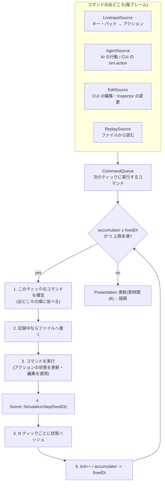

# ティックとリプレイ — 詳細設計

[determinism.md](determinism.md) の Step 1(固定タイムステップ)・Step 4(入力の記録と再生)・Step 5(リプレイとハッシュ検証)を、
実装できる粒度まで決めた文書。**決定論の方針・層の分け方・守る規約は determinism.md が一次情報**で、ここはその具体化。

- 状態: **設計のみ。実装は未着手。**
- 関連: [editor-automation.md](editor-automation.md)(CUI。リプレイの操作もコマンドにする)

---

## 1. 決めたこと(2026-09-21)

| 項目 | 決定 | 理由 |
|---|---|---|
| 時間の単位 | **時刻・期間はティック(整数)、変化の量は秒 × 固定 dt** | 整数は誤差が溜まらず、リプレイ・ハッシュの軸になる。量を秒で書けば、ティックの長さを変えても調整値が狂わない |
| 記録する入力 | **アクション層を作り、コマンドパターンで表す** | 人間(キー・パッド)も AI(エージェントの行動)も同じ「アクションのコマンド」でシムを動かせる。生のキーやマウス座標は記録しない |
| 開始時点 | **シーン全体をリプレイに埋め込む** | シーンファイルを後で編集しても、古いリプレイがそのまま再生できる |
| 記録中の編集 | **編集もコマンドとして記録する** | 調整しながら遊んだ記録もそのまま再現できる。CUI の操作がそのまま記録に乗る |

この 4 つから、**1 本の「ティック付きコマンドの列」**という形にまとまる。

> リプレイ = 開始時点のシーン + seed + ティック付きコマンドの列(プレイヤーの操作・AI の行動・エディタの編集)

---

## 2. 全体の流れ



- 記録と再生の違いは、**コマンドの出どころが入れ替わるだけ**。再生中は `ReplaySource` だけがコマンドを出し、ライブの入力と AI は止める。
- コマンドを実行する位置はティックの境目だけ。**UI やネットワークから来たものも、必ず次のティックの頭まで待たせる**(フレームの途中で状態を変えない)。

---

## 3. ティック(SimClock)

```cpp
// Scene が 1 つ持つ。シムの時間はここからしか読まない。
struct SimClock {
	uint64_t tick = 0;              // 今のティック番号(Play 開始で 0)
	float fixedDt = 1.0f / 60.0f;   // 1 ティックの長さ(プロジェクト設定。§8)
	double accumulator = 0.0;       // まだ消化していない実時間
	int maxStepsPerFrame = 5;       // これを超えた分は捨てる(スパイラル・オブ・デス対策。再生・高速実行では無制限)
	float timeScale = 1.0f;         // スロー・早送り。dt ではなく「溜める実時間」に掛ける
	bool paused = false;            // true なら溜めない。sim.step で 1 ティックずつ進められる

	double Seconds() const { return tick * static_cast<double>(fixedDt); }   // 経過秒は溜めずに毎回求める
	uint64_t SecondsToTicks(float seconds) const;                            // 四捨五入。調整値の読み込み時に 1 回だけ使う
};
```

- **`timeScale` は dt を変えない。** 溜める実時間に掛けて、進むティックの回数で速さを表す(dt を変えると結果が変わる)。
- **ポーズ中の UI やカメラは Presentation 層なので動く**(実時間 dt で更新される)。
- 既存の `Time::GetDeltaTime()` は、シムのステップ中は `fixedDt` を返す(今のゲームのコードがそのまま動く)。新しいコードは `SimClock` を読む。

### タイマーは締め切りのティックで持つ

```cpp
readyTick_ = clock.tick + clock.SecondsToTicks(cooldownSeconds_);   // 調整値は秒で書く
if (clock.tick >= readyTick_) { ... }                               // 比べるのは整数
```

---

## 4. 更新の分け方

| | 呼ばれる回数 | dt | 用途 |
|---|---|---|---|
| `Component::Update()` | **1 ティックに 1 回**(0〜N 回/フレーム) | 固定 | ゲームロジック・AI・物理。今あるゲームのコードはここ |
| `Component::PresentationUpdate(float realDt)`(新設) | 1 フレームに 1 回 | 実時間 | パーティクル・トレイル・カメラの追従・UI の演出 |

- **いっぺんに移さない。** まず全部を `Update`(固定)のまま動かし、見た目がカクつくもの(パーティクル・カメラ)から `PresentationUpdate` へ移す。
- Presentation 層はシムの状態を読むだけで、書き換えない(determinism.md §3 の唯一の規約)。

---

## 5. コマンド(SimCommand)

### 5.1 形

```cpp
// シムを動かす要求 1 件。ティックの頭で実行され、リプレイにはこのまま記録される。
class SimCommand {
public:
	virtual ~SimCommand() = default;
	virtual const char* GetType() const = 0;                 // ファイルに書く型名。Factory で作り直す
	virtual void Execute(SimContext& context) = 0;           // ティックの頭で呼ばれる
	virtual void Write(nlohmann::json& out) const = 0;       // リプレイへ
	virtual void Read(const nlohmann::json& in) = 0;         // リプレイから
};

struct TickCommand {
	uint64_t tick;                          // 実行するティック
	uint32_t source;                        // 出どころ(0 = エディタ、1.. = プレイヤー / エージェントの番号)
	std::unique_ptr<SimCommand> command;
};
```

- 型は `SimCommandFactory` に登録する(`ComponentFactory` と同じ形。GameModule もゲーム独自のコマンドを登録できる)。
- **1 ティックの中の実行順は「出どころの番号 → 積まれた順」で固定する**(記録時も再生時も同じ順)。

### 5.2 標準のコマンド

| コマンド | 中身 | 出どころ |
|---|---|---|
| `ActionCommand` | アクション名・値(量子化した整数) | プレイヤー(キー・パッド)、AI エージェント |
| `EditCommand` | CUI のコマンド 1 行(例: `field.set Boss HealthComponent hp 50`) | CUI、Inspector(§6.3) |

ゲームがもっと大きな単位の命令(「この位置へ移動」など)を使いたければ、`SimCommand` を継承して足せる。

---

## 6. アクション層

### 6.1 アクションの定義(ゲームごと)

`DirectXGame/Data/ProjectSettings/InputActions.json`:

```json
{
  "actions": [
    { "name": "Move",   "type": "axis2d", "bindings": ["WASD", "LeftStick"] },
    { "name": "Jump",   "type": "button", "bindings": ["Space", "PadA"] },
    { "name": "Attack", "type": "button", "bindings": ["MouseLeft", "PadX"] }
  ]
}
```

- 種類は `button`(0/1)・`axis1d`・`axis2d`。**軸の値は -32767〜32767 の整数に量子化してから**コマンドにする(float のまま記録すると丸めがずれる余地が残る)。
- マウスの座標は使わない。狙いなどが要るゲームは、画面の大きさに依らない値(ゲーム画面に対する -1〜1)の `axis2d` に変換してから渡す。

### 6.2 状態は変化したときだけコマンドにする

- `LiveInputSource` は毎フレーム生の入力をアクションへ変換し、**前回から値が変わったアクションだけ** `ActionCommand` を出す。押しっぱなしの間は何も出さない(記録が小さくなる)。
- シムの中には `ActionState`(プレイヤーごとの今の値)があり、`ActionCommand` の実行で更新される。
- ゲームのコードはアクションだけを読む:

```cpp
const ActionState& actions = Sim().GetActions(playerIndex);
if (actions.Pressed("Jump")) { ... }     // このティックで 0 → 1 になった
Vector2 move = actions.Axis2D("Move");   // -1〜1 に戻した値
```

- **`Pressed` / `Released` はティック単位で決まる。** 「前のティックの値」と比べて求めるので、1 フレームに 0 ティックや 2 ティック進んでも、押した瞬間が消えたり 2 回になったりしない。
- シム層から `Input::` を直接呼ぶのは禁止(determinism.md §8 の規約に追加する)。デバッグカメラなど Presentation 層は今までどおり `Input::` でよい。

### 6.3 編集もコマンドにする

| 編集の入口 | 記録のしかた |
|---|---|
| CUI の変更系コマンド(`field.set` / `object.create` など) | 記録中(Play 中)は**すぐに実行せず、`EditCommand` として次のティックの頭で実行する**。コマンドの登録に「シムを変えるか」の印を付けて振り分ける |
| Inspector の値の変更 | Inspector は値を直接書き換えるので、**ティックの境目で「選択中のオブジェクトのコンポーネント」を前のティックと比べ**、変わったキーを `field.set` の `EditCommand` として記録する(比べるのは選択中の 1 個だけなので軽い) |
| Hierarchy のドラッグ・作成・削除など(UI のみの構造変更) | v1 では対応しない。記録中に行われたら**リプレイに「再現できない」印を付けて警告する**。CUI の同じ操作(`object.create` など)なら記録できる |

- `EditCommand` は CUI のコマンドの 1 行をそのまま持ち、再生時も同じティックで `EditorCommandRegistry` に通す。**CUI とリプレイが同じ入口を共有する。**

---

## 7. シムの持ち物(SimContext)

シムの状態をシングルトンから外し、Scene の持ち物にする(DI コンテナは使わず、Scene が持って渡す)。

```cpp
struct SimContext {
	SimClock clock;
	SimRandom random;                        // PCG32(determinism.md Step 2)
	std::vector<ActionState> actions;        // プレイヤー / エージェントごと
	CommandQueue commands;
};
// Component からは Sim() で届く(オーナーの Scene の SimContext)。
```

- こうしておくと、**1 つのプロセスで Scene を何個も同時に回せる**(Step 6 の高速学習で、エピソードを並列に回す土台)。
- 描画のシングルトン(`DirectXCommon` 等)はシムに関係しないので、今は触らない。

---

## 8. リプレイファイル(`.krp`)

1 ファイルの JSON Lines(1 行 1 件)。人間も AI も読め、`git diff` もできる。大きくなったら後で gzip をかける。

```
{"kujataReplay": 1, "tickRate": 60, "seed": 1234, "scene": "Stage1", "startedAt": "2026-09-21T20:30:00",
 "engineBuild": "<exe のハッシュ>", "gameBuild": "<GameModule.dll のハッシュ>", "hashInterval": 10, "reproducible": true}
{"scene": { ...記録開始時点のシーン全体(Scene::ToJson と同じ形)... }}
{"t": 0,   "c": [{"src": 1, "type": "Action", "name": "Move", "value": [0, 32767]}]}
{"t": 42,  "c": [{"src": 1, "type": "Action", "name": "Jump", "value": 1}]}
{"t": 90,  "c": [{"src": 0, "type": "Edit", "line": "field.set Boss HealthComponent hp 50"}]}
{"t": 10,  "hash": "9f2c1e..."}
{"end": 1800, "hash": "4b7a90..."}
```

- **コマンドがあったティックだけ**行を書く(何も起きないティックは書かない)。
- ビルドのハッシュが今と違うリプレイは、**再生はするが警告を出す**(コードが変われば分岐するのが当然なので、止めはしない)。
- `tickRate`(固定 dt)はプロジェクト設定(`Project.json` の `simTickRate`。既定 60)から取り、リプレイごとに記録する。再生時はリプレイの値で回す。

---

## 9. 状態ハッシュと分岐の特定

- **何をハッシュするか**: Simulation 層の全オブジェクトの、全コンポーネントの `WriteJson`(保存される値)を、シーンの並び順に FNV-1a 64 に通す。
  Presentation 層のコンポーネント(パーティクル・トレイル・カメラの追従など。`Component::IsPresentation()` で除外)は含めない。
- **保存されない内部状態**(AI の思考中の値など)は `WriteJson` に出ないので、そのままではハッシュにも入らない。
  ゲームのコンポーネントは `AppendSimHash(StateHasher&)` を上書きすれば含められる。
- **いつ取るか**: `hashInterval` ティックごと(既定 10)と最後。
- **分岐の特定**: 再生中にハッシュが合わなかったら、
  1. 「tick 850 までは一致、tick 860 で不一致」と報告する。
  2. `replay.bisect` で、記録の最初から 850 までを高速で回し直し、851〜860 を 1 ティックずつハッシュして**分岐した 1 ティックを特定する**(決定論なので回し直せば同じ結果になる)。
  3. そのティックの前後の `state.dump` を書き出し、差分で「どのフィールドがずれたか」まで出す。

---

## 10. シーク・巻き戻し

- **v1: シークは最初から回し直す**(`replay.seek 5000` = 開始時点に戻して 5000 ティックまで描画なしで回す)。60 ティック/秒の記録なら、数分ぶんは一瞬で追いつく。
- **v2(後で): 一定ティックごとのスナップショットから回し直す。** ただし、これには「シムの状態がすべて保存できる(`WriteJson` に出る)」ことが必要。
  保存されない内部状態を持つコンポーネントがあると、スナップショットから戻したときに分岐する。§9 のハッシュで検出できるので、v1 を運用しながら洗い出す。

---

## 11. CUI のコマンド

| コマンド | 内容 |
|---|---|
| `sim.status` | ティック番号・tickRate・ポーズ・timeScale・記録/再生中か |
| `sim.pause` / `sim.resume` / `sim.step [N]` | 止める / 再開 / N ティック進める(ポーズ中のコマ送り) |
| `sim.timeScale <倍率>` | スロー・早送り(dt は変えずにティックの回数で表す) |
| `sim.action <番号> <アクション> <値>` | アクションのコマンドを積む(AI エージェントや自動テストがプレイヤーの代わりに操作する) |
| `replay.record [ファイル]` / `replay.stop` | 記録の開始 / 終了 |
| `replay.play <ファイル> [--speed max]` | 再生(`max` は描画を間引いて最速) |
| `replay.verify <ファイル>` | 最速で再生し、ハッシュが全部合うかを返す(合わなければ分岐したティック) |
| `replay.bisect <ファイル>` | 分岐した 1 ティックを特定し、前後の状態の差分を返す |
| `replay.seek <ティック>` | 再生中にそのティックへ移る |

- リプレイ・シムの操作自体は記録しない(記録するのはシムを変えるコマンドだけ)。

---

## 12. 記録が壊れる操作と扱い

| 操作 | 扱い |
|---|---|
| Hierarchy の UI で構造を変える | 「再現できない」印を付けて警告(§6.3) |
| Reload DLL(ホットリロード) | 記録を止める(コードが変わるので続けても意味がない) |
| シーンの切り替え(`SceneManager::ChangeScene`) | v1 では記録を止める。v2 で「シーン切り替えもコマンド」にする |
| Stop(Play の終了) | 記録を閉じる(`end` 行を書く) |

---

## 13. 実装の順番

determinism.md の Step 番号に合わせる。**Step 1〜3(土台)を終えるまで、記録と再生に手を出さない**(determinism.md §7)。

| Step | この文書の範囲 | 完了条件 |
|---|---|---|
| 1 | `SimClock`・ティックのループ・`sim.status/pause/resume/step/timeScale`・`Time::GetDeltaTime` の互換・`PresentationUpdate` の枠 | fps を 30/60/144 に変えても、同じティックで物体の位置が一致する(`state.dump` の差分がゼロ) |
| 2 | `SimRandom`(PCG32)・`SimContext` を Scene の持ち物にする | 同じ seed で 2 回 Play して、`state.dump` が一致する |
| 3 | 実行順の決定化(determinism.md Step 3 のとおり) | 多数のコライダーが同時に離れるシーンで、Exit のログ順が毎回同じ |
| 4 | `SimCommand` / `CommandQueue` / アクション層(`InputActions.json`・`LiveInputSource`・`ActionState`)・`sim.action` | キーで遊んだ操作と、同じアクションを `sim.action` で流した操作が、同じ結果になる |
| 5 | `.krp` の記録・再生・`EditCommand`(CUI と Inspector)・ハッシュ・`replay.verify/bisect/seek` | 同じ `.krp` を 2 回 `replay.verify` して全ハッシュ一致。わざとシムで `Random::` を使うと、分岐したティックが報告される |
| 6 | 描画なしの高速実行・複数シーンの並列(determinism.md Step 6) | 描画ありの実時間より 100 倍以上速くエピソードが回る |

---

## 14. 決めていないこと

- `ActionState` の「プレイヤー番号」と、AI エージェントの番号をどう割り振るか(対戦・協力のゲームを作るときに決める)。
- アニメーション(`AnimatorComponent`)をシム層に入れるか(determinism.md §9)。当たり判定に効くものはシム層に入れる必要がある。
- `.krp` を大きいリプレイ向けにバイナリへするか(まずは JSON Lines で運用し、大きさが問題になってから)。
